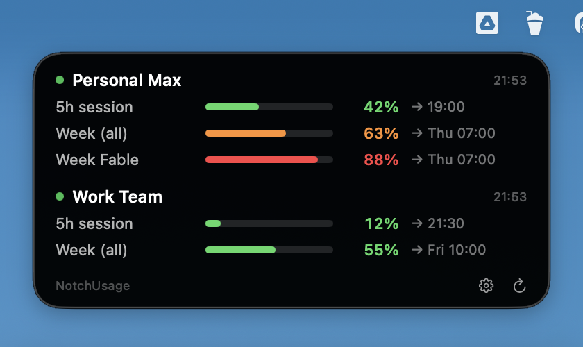

# NotchUsage

Hover your cursor over the MacBook notch — a panel drops down with current Claude subscription usage limits for **all your Claude Code profiles at once**: 5-hour session window, weekly window, per-model weekly windows (the "Fable | All models" split), percent used and reset time for each account.



Built because none of the existing notch trackers support multiple Claude accounts (personal + work via `CLAUDE_CONFIG_DIR`) simultaneously.

По-русски: [README.ru.md](README.ru.md)

## How it works

- Data comes from the same endpoint Claude Code's own `/usage` screen uses (`api.anthropic.com/api/oauth/usage`).
- OAuth tokens are read from the macOS Keychain — the same `Claude Code-credentials*` records Claude Code itself maintains. For the default `~/.claude` profile the record is named `Claude Code-credentials`; for a profile selected via `CLAUDE_CONFIG_DIR` it is `Claude Code-credentials-<first 8 hex chars of sha256(configDir)>`.
- Tokens never leave your machine except to api.anthropic.com. The refresh token is never touched, so Claude Code sessions are never invalidated.
- Hover detection polls the mouse position (80 ms) against the notch rect — no Accessibility permission needed.
- Refresh: every 5 minutes in the background, plus on hover when data is older than a minute.

## Requirements

- macOS 13+ (built and tested on macOS 26), Swift toolchain (Xcode or Command Line Tools)
- A logged-in Claude Code installation (any paid plan)

## Install

```bash
./install.sh
```

Builds the app, installs a LaunchAgent (starts at login) and launches it. On first run macOS asks for keychain access — one dialog per profile record, shown as **"NotchUsage Credentials"**; choose **Always Allow** (macOS asks for your login password to persist it).

Keychain reads go through that tiny helper binary, which is built once and cached in `build/NotchUsage Credentials` — updates and rebuilds of the main app never touch it, so macOS never asks again. (Keychain approvals are tied to the exact binary; routing reads through a never-changing helper is what makes them one-time.) Don't delete the cached helper without a reason — a fresh build of it means answering the dialogs once more.

Update: `git pull && ./install.sh`. Remove: `./uninstall.sh`.

## Configure

`~/.config/notch-usage/config.json` — generated on first install from the Claude profile directories that actually exist on your machine (`~/.claude` plus any `~/.claude-*` with a profile marker), so a single-profile setup gets a single account out of the box. Edit to rename accounts, drop entries, or add labels (full format in `config.example.json`):

```json
{
  "accounts": [
    { "name": "Personal Max", "configDir": "~/.claude" },
    { "name": "Work Team", "configDir": "~/.claude-work" }
  ],
  "refreshSeconds": 300,
  "locale": "en_US",
  "labels": { "session": "5h session", "weekly_all": "Week (all)", "weekly_scoped:Fable": "Week Fable" }
}
```

- `accounts` — one entry per Claude Code profile; `configDir` is the profile's `CLAUDE_CONFIG_DIR` (the default profile is `~/.claude`).
- `labels` — optional display names for usage windows. Keys are the `kind` values of the API's `limits` array (`session`, `weekly_all`, `weekly_scoped:<Model>`); unknown windows are shown with raw keys, and only when non-zero.
- `locale` — optional locale for reset day/time formatting (defaults to system).

The gear button in the panel opens this file in your editor; saved changes are picked up automatically within a second — no restart needed.

## Troubleshooting

```bash
./build/NotchUsage.app/Contents/MacOS/NotchUsage --print      # statuses to stdout
./build/NotchUsage.app/Contents/MacOS/NotchUsage --kc-debug   # keychain matching diagnostics (no secrets)
./build/NotchUsage.app/Contents/MacOS/NotchUsage --raw        # raw usage-endpoint response per account
./build/NotchUsage.app/Contents/MacOS/NotchUsage --selftest   # unit checks for pure functions
./build/NotchUsage.app/Contents/MacOS/NotchUsage --demo       # panel with fake data
./build/NotchUsage.app/Contents/MacOS/NotchUsage --show       # force-open the panel once (layout debugging)
tail -20 ~/Library/Logs/notchusage.log
```

Panel messages:

- *token expired — open Claude Code* — Claude Code hasn't run for a while and the stored access token lapsed; any `claude` launch refreshes it.
- *keychain access denied* — you clicked Deny; the ⟳ button in the panel re-asks.
- *no keychain record — run /login* — that profile has never logged in.
- *keychain record unreadable — re-run /login* — a record exists but holds no parsable token.
- *keychain error N* — raw OSStatus from the read; decode it with `security error N`.

## Limitations

- The notch exists only on the built-in display; with the lid closed the hover zone falls back to the top center (200 px) of the main display.
- The usage endpoint is unofficial (it is what Claude Code itself and every usage tracker uses); if the response format changes, the dynamic parser picks up any object containing `utilization`, but labels may need updating.

## License

MIT — see [LICENSE](LICENSE).
